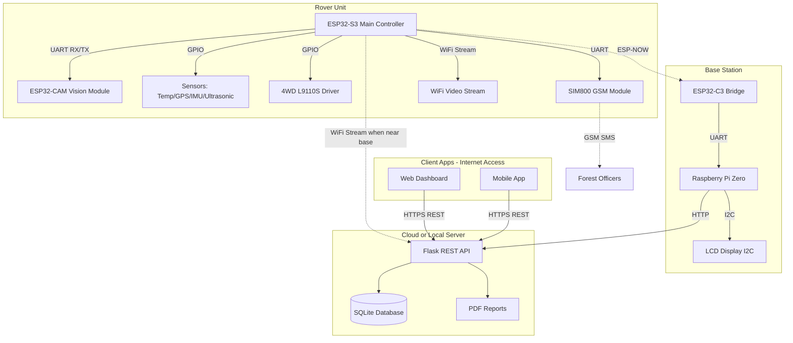
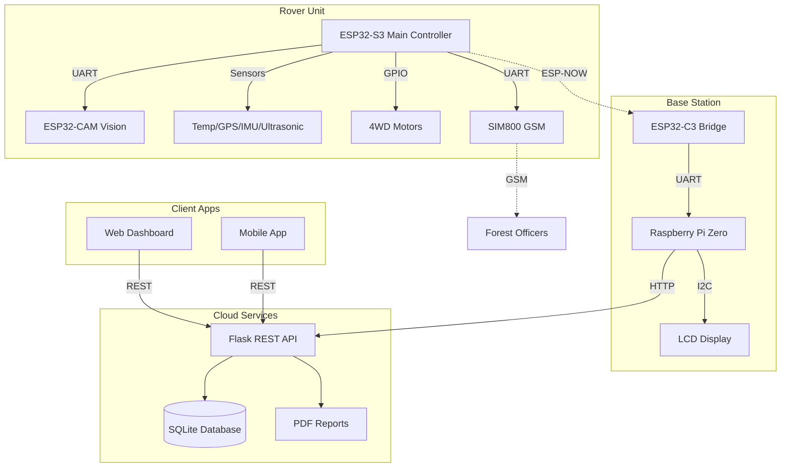

# STASIS - Comprehensive Improvement Plan

## Project Overview

**STASIS** is an autonomous forest/environmental monitoring rover system with:
- **Rover Unit (ESP32-S3)**: Main controller with sensors, motors, GPS, video streaming, and hazard detection
- **Vision System (ESP32-CAM)**: Camera module connected via UART to S3 for image processing
- **Base Station Bridge (ESP32-C3)**: Communication relay between rover and base
- **Base Station (Raspberry Pi Zero)**: Data collection, reporting, and API server
- **Dashboard (Web/Mobile)**: Real-time monitoring and control interface

### Key User Requirements
- **SMS Configuration**: Emergency SMS recipient configurable via dashboard
- **Video Streaming**: ESP32-S3 streams video when near charging station, sends images on demand otherwise
- **Authentication**: Simple API key authentication
- **Network**: Internet accessible deployment

---

## Architecture Overview



---

## Issues Found and Proposed Fixes

### 1. ESP32-S3 Rover Firmware

**File**: [`RoverProject/rover_main/rover_main.ino`](RoverProject/rover_main/rover_main.ino)

#### Critical Issues

| Issue | Description | Solution |
|-------|-------------|----------|
| No Watchdog Timer | System can hang without recovery | Add ESP task watchdog |
| Blocking Delays | delay() blocks all operations | Use non-blocking millis() timing |
| No GPS Navigation | Return-to-base just moves forward | Implement bearing-based navigation |
| Missing Sensor Error Handling | Sensor init failures not handled | Add init checks and status flags |
| Hardcoded Phone Number | SMS recipient is fixed | Add EEPROM config + dashboard setting |
| No Video Streaming | S3 should stream video near base | Add WiFi camera server |
| No Image Capture | Research mode needs photos | Add image request/response via UART |

#### New Features to Add

1. **Video Streaming Server**
   - Start WiFi server when near base station
   - Stream MJPEG from ESP32-CAM via UART
   - Stop streaming when far from base to save power

2. **Configurable SMS**
   - Store phone number in EEPROM
   - Receive config updates from base station
   - Support multiple recipients

3. **GPS Navigation**
   - Calculate bearing to base station
   - Adjust motor direction based on heading
   - Use compass (MPU6050) for orientation

4. **Non-blocking State Machine**
   - Replace all delay() with millis() timers
   - Allow continuous sensor reading
   - Responsive to commands at all times

---

### 2. ESP32-CAM Firmware

**File**: [`RoverProject/cam_firmware/cam_firmware.ino`](RoverProject/cam_firmware/cam_firmware.ino)

#### Role Change
The ESP32-CAM now only handles image capture and processing. The ESP32-S3 handles video streaming.

#### Critical Issues

| Issue | Description | Solution |
|-------|-------------|----------|
| No Error Recovery | Camera init failure exits silently | Add retry logic with LED indicator |
| Memory Leaks Risk | Frame buffer not freed on error | Add proper cleanup in all paths |
| Basic Detection | Simple color threshold | Add multi-criteria detection |
| No Image Request Protocol | S3 should request images | Add command protocol |

#### New Features

1. **Command Protocol from S3**
   - CAPTURE - Take single image
   - STREAM_START - Begin continuous frames
   - STREAM_STOP - End streaming
   - DETECT - Run detection algorithm

2. **Improved Detection**
   - Fire: Color + brightness + flicker detection
   - Motion: Frame differencing with threshold
   - Human: Simple motion pattern analysis

3. **Image Response Format**
   - Send image size header
   - Send JPEG data in chunks
   - Include detection results

---

### 3. ESP32-C3 Bridge Firmware

**File**: [`RoverProject/base_bridge/base_bridge.ino`](RoverProject/base_bridge/base_bridge.ino)

#### Critical Issues

| Issue | Description | Solution |
|-------|-------------|----------|
| No Reconnection Logic | ESP-NOW failure has no recovery | Add periodic re-init check |
| No Message Queuing | Messages can be lost | Add transmit queue |
| No Acknowledgment | Commands not confirmed | Add ESP-NOW ACK callback |
| No Status Indicator | Cannot verify operation | Add status LED |

#### New Features

1. **Message Queue**
   - Queue outgoing commands
   - Retry on failure
   - ACK confirmation

2. **Status LED**
   - Blink patterns for status
   - Fast blink = data received
   - Slow blink = idle
   - Solid = error

3. **Heartbeat**
   - Periodic status message
   - Connection health monitoring

---

### 4. Python Base Station

**File**: [`RoverProject/base_station/station_monitor.py`](RoverProject/base_station/station_monitor.py)

#### Critical Issues for Internet Deployment

| Issue | Description | Solution |
|-------|-------------|----------|
| No Authentication | API is completely open | Add API key authentication |
| No HTTPS | Unencrypted traffic | Add SSL/TLS support |
| No Rate Limiting | Can be DoS attacked | Add rate limiting |
| No CORS for Internet | CORS allows all origins | Restrict CORS origins |
| No Data Retention | Database grows forever | Add cleanup job |

#### New Features

1. **API Key Authentication**
   - Environment variable for API key
   - Header-based authentication
   - Optional: Multiple keys with roles

2. **HTTPS Support**
   - Self-signed cert for development
   - Let's Encrypt for production
   - Auto-redirect HTTP to HTTPS

3. **Rate Limiting**
   - Per-IP rate limiting
   - Burst allowance
   - Whitelist for local network

4. **Configuration Management**
   - SMS recipients storage
   - Rover settings sync
   - Alert thresholds

5. **Data Retention**
   - Keep 30 days detailed data
   - Archive older data
   - Daily cleanup job

#### New API Endpoints

| Endpoint | Method | Description |
|----------|--------|-------------|
| /api/config | GET | Get all configuration |
| /api/config/sms | POST | Update SMS recipients |
| /api/config/rover | POST | Update rover settings |
| /api/stream | GET | Proxy video from rover |
| /api/capture | POST | Request image capture |
| /api/export/csv | GET | Export telemetry as CSV |
| /api/export/json | GET | Export telemetry as JSON |
| /api/alerts | GET | Get alert history |
| /api/alerts/ack | POST | Acknowledge alert |

---

### 5. Dashboard Enhancement

**File**: [`RoverProject/rover_dashboard/index.html`](RoverProject/rover_dashboard/index.html)

#### Missing Features to Add

| Feature | Description | Priority |
|---------|-------------|----------|
| Video Feed Panel | Live stream when rover near base | High |
| Image Capture Button | Request still image on demand | High |
| Alert History Panel | Show recent alerts with details | High |
| SMS Configuration | Set emergency contact numbers | High |
| Settings Panel | Configure rover parameters | Medium |
| Path History | Show rover trail on map | Medium |
| Data Export | Download telemetry data | Low |
| PWA Support | Install as mobile app | Low |

#### New UI Components

1. **Video Feed Section**
   - Live MJPEG stream display
   - Capture button for still image
   - Fullscreen toggle
   - Connection status indicator

2. **Alert History Panel**
   - List of recent alerts
   - Timestamp, type, location
   - Acknowledge button
   - Filter by type

3. **SMS Configuration Modal**
   - Add/remove phone numbers
   - Test SMS button
   - Save to base station

4. **Enhanced Settings**
   - Rover patrol parameters
   - Alert thresholds
   - Base station coordinates
   - API key configuration

---

## Implementation Plan

### Phase 1: Critical Fixes
1. Add watchdog timer to ESP32-S3 firmware
2. Implement non-blocking state machine
3. Add error handling to all firmware
4. Add API key authentication to base station
5. Fix ESP-NOW reliability in bridge

### Phase 2: Video and Configuration
1. Implement video streaming on ESP32-S3
2. Add image capture protocol to ESP32-CAM
3. Add SMS configuration endpoints
4. Add video feed to dashboard
5. Add settings panel to dashboard

### Phase 3: Navigation and Intelligence
1. Implement GPS navigation to base
2. Add improved detection algorithms
3. Add alert history panel
4. Implement data retention
5. Add data export features

### Phase 4: Polish and Security
1. Add HTTPS support
2. Add rate limiting
3. Add PWA support
4. Create comprehensive documentation
5. Add test suite

---

## Files to Create/Modify

| File | Action | Changes |
|------|--------|---------|
| rover_main.ino | Modify | Watchdog, non-blocking, video stream, GPS nav, EEPROM config |
| cam_firmware.ino | Modify | Command protocol, improved detection, image response |
| base_bridge.ino | Modify | ACK, queue, status LED, reconnection |
| station_monitor.py | Modify | Auth, HTTPS, rate limiting, config endpoints, retention |
| index.html | Modify | Video feed, alerts panel, SMS config, settings |
| README.md | Create | Project documentation and setup guide |
| config.yaml | Create | Centralized configuration |
| requirements.txt | Create | Python dependencies |

---

## Security Considerations for Internet Deployment

1. **API Key**: Store in environment variable, rotate regularly
2. **HTTPS**: Use Let's Encrypt for valid certificates
3. **Rate Limiting**: Prevent DoS attacks
4. **Input Validation**: Sanitize all inputs
5. **CORS**: Restrict to known domains
6. **Logging**: Log all access and errors
7. **Backup**: Regular database backups

---

*Plan updated: 2026-02-19*
*Status: Ready for implementation*

## Project Overview

**Stasis** is an autonomous forest/environmental monitoring rover system with:
- **Rover Unit (ESP32-S3)**: Main controller with sensors, motors, GPS, video streaming, and hazard detection
- **Vision System (ESP32-CAM)**: Camera module connected via UART to S3 for image processing
- **Base Station Bridge (ESP32-C3)**: Communication relay between rover and base
- **Base Station (Raspberry Pi Zero)**: Data collection, reporting, and API server
- **Dashboard (Web/Mobile)**: Real-time monitoring and control interface

### Key User Requirements
- **SMS Configuration**: Emergency SMS recipient configurable via dashboard
- **Video Streaming**: ESP32-S3 streams video when near charging station, sends images on demand otherwise
- **Authentication**: Simple API key authentication
- **Network**: Internet accessible deployment

---

## Architecture Overview


---

## Issues Found and Proposed Fixes

### 1. ESP32-S3 Rover Firmware

**File**: [`RoverProject/rover_main/rover_main.ino`](RoverProject/rover_main/rover_main.ino)

#### Critical Issues

| Issue | Description | Solution |
|-------|-------------|----------|
| No Watchdog Timer | System can hang without recovery | Add ESP task watchdog |
| Blocking Delays | delay() blocks all operations | Use non-blocking millis() timing |
| No GPS Navigation | Return-to-base just moves forward | Implement bearing-based navigation |
| Missing Sensor Error Handling | Sensor init failures not handled | Add init checks and status flags |
| Hardcoded Phone Number | SMS recipient is fixed | Add EEPROM config + dashboard setting |
| No Video Streaming | S3 should stream video near base | Add WiFi camera server |
| No Image Capture | Research mode needs photos | Add image request/response via UART |

#### New Features to Add

1. **Video Streaming Server**
   - Start WiFi server when near base station
   - Stream MJPEG from ESP32-CAM via UART
   - Stop streaming when far from base to save power

2. **Configurable SMS**
   - Store phone number in EEPROM
   - Receive config updates from base station
   - Support multiple recipients

3. **GPS Navigation**
   - Calculate bearing to base station
   - Adjust motor direction based on heading
   - Use compass (MPU6050) for orientation

4. **Non-blocking State Machine**
   - Replace all delay() with millis() timers
   - Allow continuous sensor reading
   - Responsive to commands at all times

---

### 2. ESP32-CAM Firmware

**File**: [`RoverProject/cam_firmware/cam_firmware.ino`](RoverProject/cam_firmware/cam_firmware.ino)

#### Role Change
The ESP32-CAM now only handles image capture and processing. The ESP32-S3 handles video streaming.

#### Critical Issues

| Issue | Description | Solution |
|-------|-------------|----------|
| No Error Recovery | Camera init failure exits silently | Add retry logic with LED indicator |
| Memory Leaks Risk | Frame buffer not freed on error | Add proper cleanup in all paths |
| Basic Detection | Simple color threshold | Add multi-criteria detection |
| No Image Request Protocol | S3 should request images | Add command protocol |

#### New Features

1. **Command Protocol from S3**
   - CAPTURE - Take single image
   - STREAM_START - Begin continuous frames
   - STREAM_STOP - End streaming
   - DETECT - Run detection algorithm

2. **Improved Detection**
   - Fire: Color + brightness + flicker detection
   - Motion: Frame differencing with threshold
   - Human: Simple motion pattern analysis

3. **Image Response Format**
   - Send image size header
   - Send JPEG data in chunks
   - Include detection results

---

### 3. ESP32-C3 Bridge Firmware

**File**: [`RoverProject/base_bridge/base_bridge.ino`](RoverProject/base_bridge/base_bridge.ino)

#### Critical Issues

| Issue | Description | Solution |
|-------|-------------|----------|
| No Reconnection Logic | ESP-NOW failure has no recovery | Add periodic re-init check |
| No Message Queuing | Messages can be lost | Add transmit queue |
| No Acknowledgment | Commands not confirmed | Add ESP-NOW ACK callback |
| No Status Indicator | Cannot verify operation | Add status LED |

#### New Features

1. **Message Queue**
   - Queue outgoing commands
   - Retry on failure
   - ACK confirmation

2. **Status LED**
   - Blink patterns for status
   - Fast blink = data received
   - Slow blink = idle
   - Solid = error

3. **Heartbeat**
   - Periodic status message
   - Connection health monitoring

---

### 4. Python Base Station

**File**: [`RoverProject/base_station/station_monitor.py`](RoverProject/base_station/station_monitor.py)

#### Critical Issues for Internet Deployment

| Issue | Description | Solution |
|-------|-------------|----------|
| No Authentication | API is completely open | Add API key authentication |
| No HTTPS | Unencrypted traffic | Add SSL/TLS support |
| No Rate Limiting | Can be DoS attacked | Add rate limiting |
| No CORS for Internet | CORS allows all origins | Restrict CORS origins |
| No Data Retention | Database grows forever | Add cleanup job |

#### New Features

1. **API Key Authentication**
   - Environment variable for API key
   - Header-based authentication
   - Optional: Multiple keys with roles

2. **HTTPS Support**
   - Self-signed cert for development
   - Let's Encrypt for production
   - Auto-redirect HTTP to HTTPS

3. **Rate Limiting**
   - Per-IP rate limiting
   - Burst allowance
   - Whitelist for local network

4. **Configuration Management**
   - SMS recipients storage
   - Rover settings sync
   - Alert thresholds

5. **Data Retention**
   - Keep 30 days detailed data
   - Archive older data
   - Daily cleanup job

#### New API Endpoints

| Endpoint | Method | Description |
|----------|--------|-------------|
| /api/config | GET | Get all configuration |
| /api/config/sms | POST | Update SMS recipients |
| /api/config/rover | POST | Update rover settings |
| /api/stream | GET | Proxy video from rover |
| /api/capture | POST | Request image capture |
| /api/export/csv | GET | Export telemetry as CSV |
| /api/export/json | GET | Export telemetry as JSON |
| /api/alerts | GET | Get alert history |
| /api/alerts/ack | POST | Acknowledge alert |

---

### 5. Dashboard Enhancement

**File**: [`RoverProject/rover_dashboard/index.html`](RoverProject/rover_dashboard/index.html)

#### Missing Features to Add

| Feature | Description | Priority |
|---------|-------------|----------|
| Video Feed Panel | Live stream when rover near base | High |
| Image Capture Button | Request still image on demand | High |
| Alert History Panel | Show recent alerts with details | High |
| SMS Configuration | Set emergency contact numbers | High |
| Settings Panel | Configure rover parameters | Medium |
| Path History | Show rover trail on map | Medium |
| Data Export | Download telemetry data | Low |
| PWA Support | Install as mobile app | Low |

#### New UI Components

1. **Video Feed Section**
   - Live MJPEG stream display
   - Capture button for still image
   - Fullscreen toggle
   - Connection status indicator

2. **Alert History Panel**
   - List of recent alerts
   - Timestamp, type, location
   - Acknowledge button
   - Filter by type

3. **SMS Configuration Modal**
   - Add/remove phone numbers
   - Test SMS button
   - Save to base station

4. **Enhanced Settings**
   - Rover patrol parameters
   - Alert thresholds
   - Base station coordinates
   - API key configuration

---

## Implementation Plan

### Phase 1: Critical Fixes
1. Add watchdog timer to ESP32-S3 firmware
2. Implement non-blocking state machine
3. Add error handling to all firmware
4. Add API key authentication to base station
5. Fix ESP-NOW reliability in bridge

### Phase 2: Video and Configuration
1. Implement video streaming on ESP32-S3
2. Add image capture protocol to ESP32-CAM
3. Add SMS configuration endpoints
4. Add video feed to dashboard
5. Add settings panel to dashboard

### Phase 3: Navigation and Intelligence
1. Implement GPS navigation to base
2. Add improved detection algorithms
3. Add alert history panel
4. Implement data retention
5. Add data export features

### Phase 4: Polish and Security
1. Add HTTPS support
2. Add rate limiting
3. Add PWA support
4. Create comprehensive documentation
5. Add test suite

---

## Files to Create/Modify

| File | Action | Changes |
|------|--------|---------|
| rover_main.ino | Modify | Watchdog, non-blocking, video stream, GPS nav, EEPROM config |
| cam_firmware.ino | Modify | Command protocol, improved detection, image response |
| base_bridge.ino | Modify | ACK, queue, status LED, reconnection |
| station_monitor.py | Modify | Auth, HTTPS, rate limiting, config endpoints, retention |
| index.html | Modify | Video feed, alerts panel, SMS config, settings |
| README.md | Create | Project documentation and setup guide |
| config.yaml | Create | Centralized configuration |
| requirements.txt | Create | Python dependencies |

---

## Security Considerations for Internet Deployment

1. **API Key**: Store in environment variable, rotate regularly
2. **HTTPS**: Use Let's Encrypt for valid certificates
3. **Rate Limiting**: Prevent DoS attacks
4. **Input Validation**: Sanitize all inputs
5. **CORS**: Restrict to known domains
6. **Logging**: Log all access and errors
7. **Backup**: Regular database backups

---

*Plan updated: 2026-02-19*
*Status: Ready for implementation*

GET  /api/alerts          # Get alert history
POST /api/alerts/ack      # Acknowledge alert
```

---

### 5. Dashboard Enhancement

**File**: [`RoverProject/rover_dashboard/index.html`](RoverProject/rover_dashboard/index.html)

#### Missing Features to Add

| Feature | Description | Priority |
|---------|-------------|----------|
| **Video Feed Panel** | Live stream when rover near base | High |
| **Image Capture Button** | Request still image on demand | High |
| **Alert History Panel** | Show recent alerts with details | High |
| **SMS Configuration** | Set emergency contact numbers | High |
| **Settings Panel** | Configure rover parameters | Medium |
| **Path History** | Show rover trail on map | Medium |
| **Data Export** | Download telemetry data | Low |
| **PWA Support** | Install as mobile app | Low |

#### New UI Components

1. **Video Feed Section**
   - Live MJPEG stream display
   - Capture button for still image
   - Fullscreen toggle
   - Connection status indicator

2. **Alert History Panel**
   - List of recent alerts
   - Timestamp, type, location
   - Acknowledge button
   - Filter by type

3. **SMS Configuration Modal**
   - Add/remove phone numbers
   - Test SMS button
   - Save to base station

4. **Enhanced Settings**
   - Rover patrol parameters
   - Alert thresholds
   - Base station coordinates
   - API key configuration

#### Code Structure

```javascript
// Video streaming
function initVideoFeed() {
    const videoImg = document.getElementById('videoFeed');
    videoImg.src = `${API_BASE}/api/stream`;
}

function captureImage() {
    fetch(`${API_BASE}/api/capture`, { method: 'POST' })
        .then(r => r.json())
        .then(data => showCapturedImage(data.imageUrl));
}

// SMS Configuration
function loadSmsConfig() {
    fetch(`${API_BASE}/api/config/sms`, {
        headers: { 'X-API-Key': API_KEY }
    })
        .then(r => r.json())
        .then(config => updateSmsUI(config));
}

function saveSmsConfig(phones) {
    fetch(`${API_BASE}/api/config/sms`, {
        method: 'POST',
        headers: {
            'Content-Type': 'application/json',
            'X-API-Key': API_KEY
        },
        body: JSON.stringify({ phones })
    });
}

// Alert history
function loadAlertHistory() {
    fetch(`${API_BASE}/api/alerts`, {
        headers: { 'X-API-Key': API_KEY }
    })
        .then(r => r.json())
        .then(alerts => renderAlertList(alerts));
}
```

---

## Implementation Plan

### Phase 1: Critical Fixes
1. Add watchdog timer to ESP32-S3 firmware
2. Implement non-blocking state machine
3. Add error handling to all firmware
4. Add API key authentication to base station
5. Fix ESP-NOW reliability in bridge

### Phase 2: Video & Configuration
1. Implement video streaming on ESP32-S3
2. Add image capture protocol to ESP32-CAM
3. Add SMS configuration endpoints
4. Add video feed to dashboard
5. Add settings panel to dashboard

### Phase 3: Navigation & Intelligence
1. Implement GPS navigation to base
2. Add improved detection algorithms
3. Add alert history panel
4. Implement data retention
5. Add data export features

### Phase 4: Polish & Security
1. Add HTTPS support
2. Add rate limiting
3. Add PWA support
4. Create comprehensive documentation
5. Add test suite

---

## Files to Create/Modify

| File | Action | Changes |
|------|--------|---------|
| `rover_main.ino` | Modify | Watchdog, non-blocking, video stream, GPS nav, EEPROM config |
| `cam_firmware.ino` | Modify | Command protocol, improved detection, image response |
| `base_bridge.ino` | Modify | ACK, queue, status LED, reconnection |
| `station_monitor.py` | Modify | Auth, HTTPS, rate limiting, config endpoints, retention |
| `index.html` | Modify | Video feed, alerts panel, SMS config, settings |
| `README.md` | Create | Project documentation and setup guide |
| `config.yaml` | Create | Centralized configuration |
| `requirements.txt` | Create | Python dependencies |

---

## Security Considerations for Internet Deployment

1. **API Key**: Store in environment variable, rotate regularly
2. **HTTPS**: Use Let's Encrypt for valid certificates
3. **Rate Limiting**: Prevent DoS attacks
4. **Input Validation**: Sanitize all inputs
5. **CORS**: Restrict to known domains
6. **Logging**: Log all access and errors
7. **Backup**: Regular database backups

---

*Plan updated: 2026-02-19*
*Status: Ready for implementation*

## Project Overview

**Stasis** is an autonomous forest/environmental monitoring rover system with:
- **Rover Unit (ESP32-S3)**: Main controller with sensors, motors, GPS, video streaming, and hazard detection
- **Vision System (ESP32-CAM)**: Camera module connected via UART to S3 for image processing
- **Base Station Bridge (ESP32-C3)**: Communication relay between rover and base
- **Base Station (Raspberry Pi Zero)**: Data collection, reporting, and API server
- **Dashboard (Web/Mobile)**: Real-time monitoring and control interface

### Key User Requirements
- **SMS Configuration**: Emergency SMS recipient configurable via dashboard
- **Video Streaming**: ESP32-S3 streams video when near charging station, sends images on demand otherwise
- **Authentication**: Simple API key authentication
- **Network**: Internet accessible deployment

---

## Architecture Overview


---

## Issues Found & Proposed Fixes

### 1. ESP32-S3 Rover Firmware

**File**: [`RoverProject/rover_main/rover_main.ino`](RoverProject/rover_main/rover_main.ino)

#### Critical Issues

| Issue | Description | Solution |
|-------|-------------|----------|
| **No Watchdog Timer** | System can hang without recovery | Add ESP task watchdog |
| **Blocking Delays** | `delay()` blocks all operations | Use non-blocking millis() timing |
| **No GPS Navigation** | Return-to-base just moves forward | Implement bearing-based navigation |
| **Missing Sensor Error Handling** | Sensor init failures not handled | Add init checks and status flags |
| **Hardcoded Phone Number** | SMS recipient is fixed | Add EEPROM config + dashboard setting |
| **No Video Streaming** | S3 should stream video near base | Add WiFi camera server |
| **No Image Capture** | Research mode needs photos | Add image request/response via UART |

#### New Features to Add

1. **Video Streaming Server**
   - Start WiFi server when near base station
   - Stream MJPEG from ESP32-CAM via UART
   - Stop streaming when far from base to save power

2. **Configurable SMS**
   - Store phone number in EEPROM
   - Receive config updates from base station
   - Support multiple recipients

3. **GPS Navigation**
   - Calculate bearing to base station
   - Adjust motor direction based on heading
   - Use compass (MPU6050) for orientation

4. **Non-blocking State Machine**
   - Replace all delay() with millis() timers
   - Allow continuous sensor reading
   - Responsive to commands at all times

#### Code Structure

```cpp
// Main improvements needed

// 1. Watchdog Timer
#include <esp_task_wdt.h>
#define WDT_TIMEOUT 30

// 2. EEPROM for configuration
#include <EEPROM.h>
typedef struct {
    char phone1[16];
    char phone2[16];
    float baseLat;
    float baseLng;
    uint8_t configValid;
} RoverConfig;

// 3. Video streaming when near base
#include <WiFiServer.h>
WiFiServer streamServer(81);

// 4. Non-blocking timers
unsigned long lastSensorRead = 0;
unsigned long lastTelemetry = 0;
unsigned long stateTimer = 0;

// 5. GPS Navigation
float calculateBearing(float lat1, float lon1, float lat2, float lon2);
void navigateToBase();

// 6. Image capture request
void requestImageFromCam();
```

---

### 2. ESP32-CAM Firmware

**File**: [`RoverProject/cam_firmware/cam_firmware.ino`](RoverProject/cam_firmware/cam_firmware.ino)

#### Role Change
The ESP32-CAM now only handles image capture and processing. The ESP32-S3 handles video streaming.

#### Critical Issues

| Issue | Description | Solution |
|-------|-------------|----------|
| **No Error Recovery** | Camera init failure exits silently | Add retry logic with LED indicator |
| **Memory Leaks Risk** | Frame buffer not freed on error | Add proper cleanup in all paths |
| **Basic Detection** | Simple color threshold | Add multi-criteria detection |
| **No Image Request Protocol** | S3 should request images | Add command protocol |

#### New Features

1. **Command Protocol from S3**
   - `CAPTURE` - Take single image
   - `STREAM_START` - Begin continuous frames
   - `STREAM_STOP` - End streaming
   - `DETECT` - Run detection algorithm

2. **Improved Detection**
   - Fire: Color + brightness + flicker detection
   - Motion: Frame differencing with threshold
   - Human: Simple motion pattern analysis

3. **Image Response Format**
   - Send image size header
   - Send JPEG data in chunks
   - Include detection results

#### Code Structure

```cpp
// Command protocol
typedef enum {
    CMD_CAPTURE = 0x01,
    CMD_STREAM_START = 0x02,
    CMD_STREAM_STOP = 0x03,
    CMD_DETECT = 0x04
} CamCommand;

typedef struct {
    bool fire;
    bool motion;
    bool human;
    float confidence;
    uint16_t firePixels;
    uint16_t motionPixels;
} DetectionResult;

// Main loop
void loop() {
    if (Serial.available()) {
        uint8_t cmd = Serial.read();
        handleCommand(cmd);
    }
}

void handleCommand(uint8_t cmd) {
    switch (cmd) {
        case CMD_CAPTURE:
            captureAndSend();
            break;
        case CMD_DETECT:
            detectAndReport();
            break;
        case CMD_STREAM_START:
            streaming = true;
            break;
        case CMD_STREAM_STOP:
            streaming = false;
            break;
    }
}
```

---

### 3. ESP32-C3 Bridge Firmware

**File**: [`RoverProject/base_bridge/base_bridge.ino`](RoverProject/base_bridge/base_bridge.ino)

#### Critical Issues

| Issue | Description | Solution |
|-------|-------------|----------|
| **No Reconnection Logic** | ESP-NOW failure has no recovery | Add periodic re-init check |
| **No Message Queuing** | Messages can be lost | Add transmit queue |
| **No Acknowledgment** | Commands not confirmed | Add ESP-NOW ACK callback |
| **No Status Indicator** | Can't verify operation | Add status LED |

#### New Features

1. **Message Queue**
   - Queue outgoing commands
   - Retry on failure
   - ACK confirmation

2. **Status LED**
   - Blink patterns for status
   - Fast blink = data received
   - Slow blink = idle
   - Solid = error

3. **Heartbeat**
   - Periodic status message
   - Connection health monitoring

#### Code Structure

```cpp
// Message queue
#define QUEUE_SIZE 10
typedef struct {
    CommandPacket cmd;
    uint8_t retries;
    unsigned long lastAttempt;
} QueuedCommand;

QueuedCommand cmdQueue[QUEUE_SIZE];
int queueHead = 0, queueTail = 0;

// ESP-NOW callbacks
void onDataRecv(const uint8_t *mac, const uint8_t *data, int len);
void onDataSent(const uint8_t *mac, esp_now_send_status_t status);

// Status LED
#define LED_PIN 8
void blinkStatus(int pattern);
```

---

### 4. Python Base Station

**File**: [`RoverProject/base_station/station_monitor.py`](RoverProject/base_station/station_monitor.py)

#### Critical Issues for Internet Deployment

| Issue | Description | Solution |
|-------|-------------|----------|
| **No Authentication** | API is completely open | Add API key authentication |
| **No HTTPS** | Unencrypted traffic | Add SSL/TLS support |
| **No Rate Limiting** | Can be DoS attacked | Add rate limiting |
| **No CORS for Internet** | CORS allows all origins | Restrict CORS origins |
| **No Data Retention** | Database grows forever | Add cleanup job |

#### New Features

1. **API Key Authentication**
   - Environment variable for API key
   - Header-based authentication
   - Optional: Multiple keys with roles

2. **HTTPS Support**
   - Self-signed cert for development
   - Let's Encrypt for production
   - Auto-redirect HTTP to HTTPS

3. **Rate Limiting**
   - Per-IP rate limiting
   - Burst allowance
   - Whitelist for local network

4. **Configuration Management**
   - SMS recipients storage
   - Rover settings sync
   - Alert thresholds

5. **Data Retention**
   - Keep 30 days detailed data
   - Archive older data
   - Daily cleanup job

#### New API Endpoints

```python
# Configuration endpoints
GET  /api/config          # Get all configuration
POST /api/config/sms      # Update SMS recipients
POST /api/config/rover    # Update rover settings

# Video streaming proxy
GET  /api/stream          # Proxy video from rover
GET  /api/capture         # Request image capture

# Data export
GET  /api/export/csv      # Export telemetry as CSV
GET  /api/export/json     # Export telemetry as JSON

# Alerts management
GET  /api/alerts          # Get alert history
POST /api/alerts/ack      # Acknowledge alert
```

---

### 5. Dashboard Enhancement

**File**: [`RoverProject/rover_dashboard/index.html`](RoverProject/rover_dashboard/index.html)

#### Missing Features to Add

| Feature | Description | Priority |
|---------|-------------|----------|
| **Video Feed Panel** | Live stream when rover near base | High |
| **Image Capture Button** | Request still image on demand | High |
| **Alert History Panel** | Show recent alerts with details | High |
| **SMS Configuration** | Set emergency contact numbers | High |
| **Settings Panel** | Configure rover parameters | Medium |
| **Path History** | Show rover trail on map | Medium |
| **Data Export** | Download telemetry data | Low |
| **PWA Support** | Install as mobile app | Low |

#### New UI Components

1. **Video Feed Section**
   - Live MJPEG stream display
   - Capture button for still image
   - Fullscreen toggle
   - Connection status indicator

2. **Alert History Panel**
   - List of recent alerts
   - Timestamp, type, location
   - Acknowledge button
   - Filter by type

3. **SMS Configuration Modal**
   - Add/remove phone numbers
   - Test SMS button
   - Save to base station

4. **Enhanced Settings**
   - Rover patrol parameters
   - Alert thresholds
   - Base station coordinates
   - API key configuration

#### Code Structure

```javascript
// Video streaming
function initVideoFeed() {
    const videoImg = document.getElementById('videoFeed');
    videoImg.src = `${API_BASE}/api/stream`;
}

function captureImage() {
    fetch(`${API_BASE}/api/capture`, { method: 'POST' })
        .then(r => r.json())
        .then(data => showCapturedImage(data.imageUrl));
}

// SMS Configuration
function loadSmsConfig() {
    fetch(`${API_BASE}/api/config/sms`, {
        headers: { 'X-API-Key': API_KEY }
    })
        .then(r => r.json())
        .then(config => updateSmsUI(config));
}

function saveSmsConfig(phones) {
    fetch(`${API_BASE}/api/config/sms`, {
        method: 'POST',
        headers: {
            'Content-Type': 'application/json',
            'X-API-Key': API_KEY
        },
        body: JSON.stringify({ phones })
    });
}

// Alert history
function loadAlertHistory() {
    fetch(`${API_BASE}/api/alerts`, {
        headers: { 'X-API-Key': API_KEY }
    })
        .then(r => r.json())
        .then(alerts => renderAlertList(alerts));
}
```

---

## Implementation Plan

### Phase 1: Critical Fixes
1. Add watchdog timer to ESP32-S3 firmware
2. Implement non-blocking state machine
3. Add error handling to all firmware
4. Add API key authentication to base station
5. Fix ESP-NOW reliability in bridge

### Phase 2: Video & Configuration
1. Implement video streaming on ESP32-S3
2. Add image capture protocol to ESP32-CAM
3. Add SMS configuration endpoints
4. Add video feed to dashboard
5. Add settings panel to dashboard

### Phase 3: Navigation & Intelligence
1. Implement GPS navigation to base
2. Add improved detection algorithms
3. Add alert history panel
4. Implement data retention
5. Add data export features

### Phase 4: Polish & Security
1. Add HTTPS support
2. Add rate limiting
3. Add PWA support
4. Create comprehensive documentation
5. Add test suite

---

## Files to Create/Modify

| File | Action | Changes |
|------|--------|---------|
| `rover_main.ino` | Modify | Watchdog, non-blocking, video stream, GPS nav, EEPROM config |
| `cam_firmware.ino` | Modify | Command protocol, improved detection, image response |
| `base_bridge.ino` | Modify | ACK, queue, status LED, reconnection |
| `station_monitor.py` | Modify | Auth, HTTPS, rate limiting, config endpoints, retention |
| `index.html` | Modify | Video feed, alerts panel, SMS config, settings |
| `README.md` | Create | Project documentation and setup guide |
| `config.yaml` | Create | Centralized configuration |
| `requirements.txt` | Create | Python dependencies |

---

## Security Considerations for Internet Deployment

1. **API Key**: Store in environment variable, rotate regularly
2. **HTTPS**: Use Let's Encrypt for valid certificates
3. **Rate Limiting**: Prevent DoS attacks
4. **Input Validation**: Sanitize all inputs
5. **CORS**: Restrict to known domains
6. **Logging**: Log all access and errors
7. **Backup**: Regular database backups

---

*Plan updated: 2026-02-19*
*Status: Ready for implementation*

typedef struct {
    bool fire;
    bool motion;
    bool human;
    float confidence;
    char description[32];
} DetectionResult;

DetectionResult analyzeFrame(camera_fb_t *fb);
```

#### Missing Features

- [ ] SD card storage for captured images
- [ ] Human detection using simple motion patterns
- [ ] Confidence scoring for detections
- [ ] Configurable detection thresholds
- [ ] Status LED for operational feedback
- [ ] Frame rate control for power saving

---

### 3. ESP32-C3 Bridge Firmware ([`base_bridge.ino`](RoverProject/base_bridge/base_bridge.ino))

#### Critical Issues

| Issue | Description | Solution |
|-------|-------------|----------|
| **No Reconnection Logic** | ESP-NOW failure has no recovery | Add periodic re-initialization |
| **No Message Queuing** | Messages can be lost | Add transmit queue buffer |
| **No Acknowledgment** | Commands not confirmed | Add ESP-NOW ACK callback |
| **No Status Indicator** | Can't verify operation | Add status LED |

#### Code Improvements Needed

```cpp
// Add ESP-NOW acknowledgment
void onSent(const uint8_t *mac, esp_now_send_status_t status) {
    if (status == ESP_NOW_SEND_SUCCESS) {
        digitalWrite(LED_PIN, HIGH);
    }
}

// Add message queue
#define QUEUE_SIZE 10
CommandPacket cmdQueue[QUEUE_SIZE];
int queueHead = 0, queueTail = 0;

void queueCommand(CommandPacket cmd) {
    cmdQueue[queueTail] = cmd;
    queueTail = (queueTail + 1) % QUEUE_SIZE;
}

// Register callbacks
esp_now_register_send_cb(onSent);
```

#### Missing Features

- [ ] Status LED for operational feedback
- [ ] Command acknowledgment system
- [ ] Message queue for reliability
- [ ] Periodic heartbeat signal
- [ ] Configuration mode for setup

---

### 4. Python Base Station ([`station_monitor.py`](RoverProject/base_station/station_monitor.py))

#### Critical Issues

| Issue | Description | Solution |
|-------|-------------|----------|
| **No Authentication** | API is completely open | Add API key authentication |
| **No Rate Limiting** | Can be flooded with requests | Add rate limiting middleware |
| **No Data Retention** | Database grows indefinitely | Add data cleanup job |
| **No Alert Notifications** | Hazards only logged | Add push/email notifications |

#### Code Improvements Needed

```python
# Add API key authentication
from functools import wraps

API_KEY = os.environ.get('API_KEY', 'your-secret-key')

def require_api_key(f):
    @wraps(f)
    def decorated(*args, **kwargs):
        key = request.headers.get('X-API-Key')
        if key != API_KEY:
            abort(401)
        return f(*args, **kwargs)
    return decorated

# Add rate limiting
from flask_limiter import Limiter
limiter = Limiter(app, default_limits=['100 per minute'])

# Add data retention
def cleanup_old_data():
    conn = get_db_connection()
    conn.execute(
        'DELETE FROM telemetry WHERE timestamp < datetime("now", "-30 days")'
    )
    conn.commit()
    conn.close()

# Add alert notifications
def send_alert_notification(data):
    # Email, push notification, or webhook
    pass
```

#### Missing Features

- [ ] Configuration file support (YAML/JSON)
- [ ] HTTPS support with SSL certificates
- [ ] Email/SMS alert notifications
- [ ] Data backup automation
- [ ] Health monitoring dashboard
- [ ] Log rotation

---

### 5. Dashboard ([`index.html`](RoverProject/rover_dashboard/index.html))

#### Missing Features

| Feature | Description | Priority |
|---------|-------------|----------|
| **Alert History Panel** | Show recent alerts with details | High |
| **Camera Feed** | Display live camera from rover | High |
| **Mission Planning** | Set patrol waypoints | Medium |
| **Path History** | Show rover trail on map | Medium |
| **Offline Mode** | Cache data when disconnected | Medium |
| **Data Export** | Export telemetry as CSV/JSON | Low |
| **PWA Support** | Install as mobile app | Low |
| **Authentication** | Login system for security | High |

#### Code Improvements Needed

```javascript
// Add alert history panel
async function fetchAlerts() {
    const response = await fetch(`${API_BASE}/api/alerts`);
    const alerts = await response.json();
    updateAlertPanel(alerts);
}

// Add camera feed (if ESP32-CAM streams)
function initCameraFeed() {
    const img = document.getElementById('cameraFeed');
    img.src = 'http://rover-cam-ip:81/stream';
}

// Add offline mode with service worker
if ('serviceWorker' in navigator) {
    navigator.serviceWorker.register('/sw.js');
}

// Add data export
function exportData(format) {
    window.open(`${API_BASE}/api/export?format=${format}`);
}
```

#### UI Enhancements

- [ ] Dark/Light theme toggle
- [ ] Configurable dashboard layout
- [ ] Touch gestures for map control
- [ ] Audio alerts for hazards
- [ ] Battery warning notifications
- [ ] Connection quality indicator

---

### 6. General Project Issues

#### Missing Components

| Component | Description |
|-----------|-------------|
| **README.md** | Project documentation and setup guide |
| **.gitignore** | Git ignore patterns |
| **Configuration Files** | Centralized settings |
| **Test Suite** | Unit and integration tests |
| **CI/CD Pipeline** | Automated builds and deployment |
| **Docker Support** | Containerized deployment |

---

## Proposed Architecture Improvements



---

## Implementation Priority

### Phase 1: Critical Fixes
1. Add watchdog timer to rover firmware
2. Implement non-blocking state machine
3. Add error handling to all firmware
4. Add API authentication to base station
5. Fix ESP-NOW reliability issues

### Phase 2: Feature Completion
1. Implement GPS navigation to base
2. Add image capture for research mode
3. Add alert history to dashboard
4. Implement data retention policy
5. Add configuration file support

### Phase 3: Enhancements
1. Add camera feed to dashboard
2. Implement mission planning
3. Add PWA support
4. Create comprehensive documentation
5. Add test suite

---

## Questions for Clarification

Before proceeding with implementation, I need clarification on:

1. **Phone Number Configuration**: Should the SMS recipient phone number be configurable via the dashboard, or should it be hardcoded in firmware?

2. **Camera Streaming**: Does the ESP32-CAM need to stream live video to the dashboard, or only capture still images on demand?

3. **Data Storage**: Should captured images be stored on SD card, sent to the base station, or both?

4. **Authentication Level**: What level of security is needed? Simple API key, or full JWT-based authentication?

5. **Deployment Environment**: Will the base station be accessible over the internet, or only on a local network?

6. **Power Budget**: What is the typical patrol duration, and how does it affect the power saving strategy?

---

## Files to Modify

| File | Changes |
|------|---------|
| [`rover_main.ino`](RoverProject/rover_main/rover_main.ino) | Watchdog, non-blocking, GPS nav, error handling |
| [`cam_firmware.ino`](RoverProject/cam_firmware/cam_firmware.ino) | Error recovery, image capture, improved detection |
| [`base_bridge.ino`](RoverProject/base_bridge/base_bridge.ino) | ACK, queue, status LED, reconnection |
| [`station_monitor.py`](RoverProject/base_station/station_monitor.py) | Auth, rate limiting, notifications, retention |
| [`index.html`](RoverProject/rover_dashboard/index.html) | Alert panel, camera feed, offline mode, export |
| `README.md` | New file - project documentation |
| `config.yaml` | New file - centralized configuration |

---

*Plan created: 2026-02-19*
*Status: Awaiting user feedback before implementation*


## Project Overview

**STASIS** is an autonomous forest/environmental monitoring rover system with:
- **Rover Unit (ESP32-S3)**: Main controller with sensors, motors, GPS, video streaming, and hazard detection
- **Vision System (ESP32-CAM)**: Camera module connected via UART to S3 for image processing
- **Base Station Bridge (ESP32-C3)**: Communication relay between rover and base
- **Base Station (Raspberry Pi Zero)**: Data collection, reporting, and API server
- **Dashboard (Web/Mobile)**: Real-time monitoring and control interface

### Key User Requirements
- **SMS Configuration**: Emergency SMS recipient configurable via dashboard
- **Video Streaming**: ESP32-S3 streams video when near charging station, sends images on demand otherwise
- **Authentication**: Simple API key authentication
- **Network**: Internet accessible deployment

---

## Architecture Overview


---

## Issues Found and Proposed Fixes

### 1. ESP32-S3 Rover Firmware

**File**: [`RoverProject/rover_main/rover_main.ino`](RoverProject/rover_main/rover_main.ino)

#### Critical Issues

| Issue | Description | Solution |
|-------|-------------|----------|
| No Watchdog Timer | System can hang without recovery | Add ESP task watchdog |
| Blocking Delays | delay() blocks all operations | Use non-blocking millis() timing |
| No GPS Navigation | Return-to-base just moves forward | Implement bearing-based navigation |
| Missing Sensor Error Handling | Sensor init failures not handled | Add init checks and status flags |
| Hardcoded Phone Number | SMS recipient is fixed | Add EEPROM config + dashboard setting |
| No Video Streaming | S3 should stream video near base | Add WiFi camera server |
| No Image Capture | Research mode needs photos | Add image request/response via UART |

#### New Features to Add

1. **Video Streaming Server**
   - Start WiFi server when near base station
   - Stream MJPEG from ESP32-CAM via UART
   - Stop streaming when far from base to save power

2. **Configurable SMS**
   - Store phone number in EEPROM
   - Receive config updates from base station
   - Support multiple recipients

3. **GPS Navigation**
   - Calculate bearing to base station
   - Adjust motor direction based on heading
   - Use compass (MPU6050) for orientation

4. **Non-blocking State Machine**
   - Replace all delay() with millis() timers
   - Allow continuous sensor reading
   - Responsive to commands at all times

---

### 2. ESP32-CAM Firmware

**File**: [`RoverProject/cam_firmware/cam_firmware.ino`](RoverProject/cam_firmware/cam_firmware.ino)

#### Role Change
The ESP32-CAM now only handles image capture and processing. The ESP32-S3 handles video streaming.

#### Critical Issues

| Issue | Description | Solution |
|-------|-------------|----------|
| No Error Recovery | Camera init failure exits silently | Add retry logic with LED indicator |
| Memory Leaks Risk | Frame buffer not freed on error | Add proper cleanup in all paths |
| Basic Detection | Simple color threshold | Add multi-criteria detection |
| No Image Request Protocol | S3 should request images | Add command protocol |

#### New Features

1. **Command Protocol from S3**
   - CAPTURE - Take single image
   - STREAM_START - Begin continuous frames
   - STREAM_STOP - End streaming
   - DETECT - Run detection algorithm

2. **Improved Detection**
   - Fire: Color + brightness + flicker detection
   - Motion: Frame differencing with threshold
   - Human: Simple motion pattern analysis

3. **Image Response Format**
   - Send image size header
   - Send JPEG data in chunks
   - Include detection results

---

### 3. ESP32-C3 Bridge Firmware

**File**: [`RoverProject/base_bridge/base_bridge.ino`](RoverProject/base_bridge/base_bridge.ino)

#### Critical Issues

| Issue | Description | Solution |
|-------|-------------|----------|
| No Reconnection Logic | ESP-NOW failure has no recovery | Add periodic re-init check |
| No Message Queuing | Messages can be lost | Add transmit queue |
| No Acknowledgment | Commands not confirmed | Add ESP-NOW ACK callback |
| No Status Indicator | Cannot verify operation | Add status LED |

#### New Features

1. **Message Queue**
   - Queue outgoing commands
   - Retry on failure
   - ACK confirmation

2. **Status LED**
   - Blink patterns for status
   - Fast blink = data received
   - Slow blink = idle
   - Solid = error

3. **Heartbeat**
   - Periodic status message
   - Connection health monitoring

---

### 4. Python Base Station

**File**: [`RoverProject/base_station/station_monitor.py`](RoverProject/base_station/station_monitor.py)

#### Critical Issues for Internet Deployment

| Issue | Description | Solution |
|-------|-------------|----------|
| No Authentication | API is completely open | Add API key authentication |
| No HTTPS | Unencrypted traffic | Add SSL/TLS support |
| No Rate Limiting | Can be DoS attacked | Add rate limiting |
| No CORS for Internet | CORS allows all origins | Restrict CORS origins |
| No Data Retention | Database grows forever | Add cleanup job |

#### New Features

1. **API Key Authentication**
   - Environment variable for API key
   - Header-based authentication
   - Optional: Multiple keys with roles

2. **HTTPS Support**
   - Self-signed cert for development
   - Let's Encrypt for production
   - Auto-redirect HTTP to HTTPS

3. **Rate Limiting**
   - Per-IP rate limiting
   - Burst allowance
   - Whitelist for local network

4. **Configuration Management**
   - SMS recipients storage
   - Rover settings sync
   - Alert thresholds

5. **Data Retention**
   - Keep 30 days detailed data
   - Archive older data
   - Daily cleanup job

#### New API Endpoints

| Endpoint | Method | Description |
|----------|--------|-------------|
| /api/config | GET | Get all configuration |
| /api/config/sms | POST | Update SMS recipients |
| /api/config/rover | POST | Update rover settings |
| /api/stream | GET | Proxy video from rover |
| /api/capture | POST | Request image capture |
| /api/export/csv | GET | Export telemetry as CSV |
| /api/export/json | GET | Export telemetry as JSON |
| /api/alerts | GET | Get alert history |
| /api/alerts/ack | POST | Acknowledge alert |

---

### 5. Dashboard Enhancement

**File**: [`RoverProject/rover_dashboard/index.html`](RoverProject/rover_dashboard/index.html)

#### Missing Features to Add

| Feature | Description | Priority |
|---------|-------------|----------|
| Video Feed Panel | Live stream when rover near base | High |
| Image Capture Button | Request still image on demand | High |
| Alert History Panel | Show recent alerts with details | High |
| SMS Configuration | Set emergency contact numbers | High |
| Settings Panel | Configure rover parameters | Medium |
| Path History | Show rover trail on map | Medium |
| Data Export | Download telemetry data | Low |
| PWA Support | Install as mobile app | Low |

#### New UI Components

1. **Video Feed Section**
   - Live MJPEG stream display
   - Capture button for still image
   - Fullscreen toggle
   - Connection status indicator

2. **Alert History Panel**
   - List of recent alerts
   - Timestamp, type, location
   - Acknowledge button
   - Filter by type

3. **SMS Configuration Modal**
   - Add/remove phone numbers
   - Test SMS button
   - Save to base station

4. **Enhanced Settings**
   - Rover patrol parameters
   - Alert thresholds
   - Base station coordinates
   - API key configuration

---

## Implementation Plan

### Phase 1: Critical Fixes
1. Add watchdog timer to ESP32-S3 firmware
2. Implement non-blocking state machine
3. Add error handling to all firmware
4. Add API key authentication to base station
5. Fix ESP-NOW reliability in bridge

### Phase 2: Video and Configuration
1. Implement video streaming on ESP32-S3
2. Add image capture protocol to ESP32-CAM
3. Add SMS configuration endpoints
4. Add video feed to dashboard
5. Add settings panel to dashboard

### Phase 3: Navigation and Intelligence
1. Implement GPS navigation to base
2. Add improved detection algorithms
3. Add alert history panel
4. Implement data retention
5. Add data export features

### Phase 4: Polish and Security
1. Add HTTPS support
2. Add rate limiting
3. Add PWA support
4. Create comprehensive documentation
5. Add test suite

---

## Files to Create/Modify

| File | Action | Changes |
|------|--------|---------|
| rover_main.ino | Modify | Watchdog, non-blocking, video stream, GPS nav, EEPROM config |
| cam_firmware.ino | Modify | Command protocol, improved detection, image response |
| base_bridge.ino | Modify | ACK, queue, status LED, reconnection |
| station_monitor.py | Modify | Auth, HTTPS, rate limiting, config endpoints, retention |
| index.html | Modify | Video feed, alerts panel, SMS config, settings |
| README.md | Create | Project documentation and setup guide |
| config.yaml | Create | Centralized configuration |
| requirements.txt | Create | Python dependencies |

---

## Security Considerations for Internet Deployment

1. **API Key**: Store in environment variable, rotate regularly
2. **HTTPS**: Use Let's Encrypt for valid certificates
3. **Rate Limiting**: Prevent DoS attacks
4. **Input Validation**: Sanitize all inputs
5. **CORS**: Restrict to known domains
6. **Logging**: Log all access and errors
7. **Backup**: Regular database backups

---

*Plan updated: 2026-02-19*
*Status: Ready for implementation*

## Project Overview

**Stasis** is an autonomous forest/environmental monitoring rover system with:
- **Rover Unit (ESP32-S3)**: Main controller with sensors, motors, GPS, video streaming, and hazard detection
- **Vision System (ESP32-CAM)**: Camera module connected via UART to S3 for image processing
- **Base Station Bridge (ESP32-C3)**: Communication relay between rover and base
- **Base Station (Raspberry Pi Zero)**: Data collection, reporting, and API server
- **Dashboard (Web/Mobile)**: Real-time monitoring and control interface

### Key User Requirements
- **SMS Configuration**: Emergency SMS recipient configurable via dashboard
- **Video Streaming**: ESP32-S3 streams video when near charging station, sends images on demand otherwise
- **Authentication**: Simple API key authentication
- **Network**: Internet accessible deployment

---

## Architecture Overview


---

## Issues Found and Proposed Fixes

### 1. ESP32-S3 Rover Firmware

**File**: [`RoverProject/rover_main/rover_main.ino`](RoverProject/rover_main/rover_main.ino)

#### Critical Issues

| Issue | Description | Solution |
|-------|-------------|----------|
| No Watchdog Timer | System can hang without recovery | Add ESP task watchdog |
| Blocking Delays | delay() blocks all operations | Use non-blocking millis() timing |
| No GPS Navigation | Return-to-base just moves forward | Implement bearing-based navigation |
| Missing Sensor Error Handling | Sensor init failures not handled | Add init checks and status flags |
| Hardcoded Phone Number | SMS recipient is fixed | Add EEPROM config + dashboard setting |
| No Video Streaming | S3 should stream video near base | Add WiFi camera server |
| No Image Capture | Research mode needs photos | Add image request/response via UART |

#### New Features to Add

1. **Video Streaming Server**
   - Start WiFi server when near base station
   - Stream MJPEG from ESP32-CAM via UART
   - Stop streaming when far from base to save power

2. **Configurable SMS**
   - Store phone number in EEPROM
   - Receive config updates from base station
   - Support multiple recipients

3. **GPS Navigation**
   - Calculate bearing to base station
   - Adjust motor direction based on heading
   - Use compass (MPU6050) for orientation

4. **Non-blocking State Machine**
   - Replace all delay() with millis() timers
   - Allow continuous sensor reading
   - Responsive to commands at all times

---

### 2. ESP32-CAM Firmware

**File**: [`RoverProject/cam_firmware/cam_firmware.ino`](RoverProject/cam_firmware/cam_firmware.ino)

#### Role Change
The ESP32-CAM now only handles image capture and processing. The ESP32-S3 handles video streaming.

#### Critical Issues

| Issue | Description | Solution |
|-------|-------------|----------|
| No Error Recovery | Camera init failure exits silently | Add retry logic with LED indicator |
| Memory Leaks Risk | Frame buffer not freed on error | Add proper cleanup in all paths |
| Basic Detection | Simple color threshold | Add multi-criteria detection |
| No Image Request Protocol | S3 should request images | Add command protocol |

#### New Features

1. **Command Protocol from S3**
   - CAPTURE - Take single image
   - STREAM_START - Begin continuous frames
   - STREAM_STOP - End streaming
   - DETECT - Run detection algorithm

2. **Improved Detection**
   - Fire: Color + brightness + flicker detection
   - Motion: Frame differencing with threshold
   - Human: Simple motion pattern analysis

3. **Image Response Format**
   - Send image size header
   - Send JPEG data in chunks
   - Include detection results

---

### 3. ESP32-C3 Bridge Firmware

**File**: [`RoverProject/base_bridge/base_bridge.ino`](RoverProject/base_bridge/base_bridge.ino)

#### Critical Issues

| Issue | Description | Solution |
|-------|-------------|----------|
| No Reconnection Logic | ESP-NOW failure has no recovery | Add periodic re-init check |
| No Message Queuing | Messages can be lost | Add transmit queue |
| No Acknowledgment | Commands not confirmed | Add ESP-NOW ACK callback |
| No Status Indicator | Cannot verify operation | Add status LED |

#### New Features

1. **Message Queue**
   - Queue outgoing commands
   - Retry on failure
   - ACK confirmation

2. **Status LED**
   - Blink patterns for status
   - Fast blink = data received
   - Slow blink = idle
   - Solid = error

3. **Heartbeat**
   - Periodic status message
   - Connection health monitoring

---

### 4. Python Base Station

**File**: [`RoverProject/base_station/station_monitor.py`](RoverProject/base_station/station_monitor.py)

#### Critical Issues for Internet Deployment

| Issue | Description | Solution |
|-------|-------------|----------|
| No Authentication | API is completely open | Add API key authentication |
| No HTTPS | Unencrypted traffic | Add SSL/TLS support |
| No Rate Limiting | Can be DoS attacked | Add rate limiting |
| No CORS for Internet | CORS allows all origins | Restrict CORS origins |
| No Data Retention | Database grows forever | Add cleanup job |

#### New Features

1. **API Key Authentication**
   - Environment variable for API key
   - Header-based authentication
   - Optional: Multiple keys with roles

2. **HTTPS Support**
   - Self-signed cert for development
   - Let's Encrypt for production
   - Auto-redirect HTTP to HTTPS

3. **Rate Limiting**
   - Per-IP rate limiting
   - Burst allowance
   - Whitelist for local network

4. **Configuration Management**
   - SMS recipients storage
   - Rover settings sync
   - Alert thresholds

5. **Data Retention**
   - Keep 30 days detailed data
   - Archive older data
   - Daily cleanup job

#### New API Endpoints

| Endpoint | Method | Description |
|----------|--------|-------------|
| /api/config | GET | Get all configuration |
| /api/config/sms | POST | Update SMS recipients |
| /api/config/rover | POST | Update rover settings |
| /api/stream | GET | Proxy video from rover |
| /api/capture | POST | Request image capture |
| /api/export/csv | GET | Export telemetry as CSV |
| /api/export/json | GET | Export telemetry as JSON |
| /api/alerts | GET | Get alert history |
| /api/alerts/ack | POST | Acknowledge alert |

---

### 5. Dashboard Enhancement

**File**: [`RoverProject/rover_dashboard/index.html`](RoverProject/rover_dashboard/index.html)

#### Missing Features to Add

| Feature | Description | Priority |
|---------|-------------|----------|
| Video Feed Panel | Live stream when rover near base | High |
| Image Capture Button | Request still image on demand | High |
| Alert History Panel | Show recent alerts with details | High |
| SMS Configuration | Set emergency contact numbers | High |
| Settings Panel | Configure rover parameters | Medium |
| Path History | Show rover trail on map | Medium |
| Data Export | Download telemetry data | Low |
| PWA Support | Install as mobile app | Low |

#### New UI Components

1. **Video Feed Section**
   - Live MJPEG stream display
   - Capture button for still image
   - Fullscreen toggle
   - Connection status indicator

2. **Alert History Panel**
   - List of recent alerts
   - Timestamp, type, location
   - Acknowledge button
   - Filter by type

3. **SMS Configuration Modal**
   - Add/remove phone numbers
   - Test SMS button
   - Save to base station

4. **Enhanced Settings**
   - Rover patrol parameters
   - Alert thresholds
   - Base station coordinates
   - API key configuration

---

## Implementation Plan

### Phase 1: Critical Fixes
1. Add watchdog timer to ESP32-S3 firmware
2. Implement non-blocking state machine
3. Add error handling to all firmware
4. Add API key authentication to base station
5. Fix ESP-NOW reliability in bridge

### Phase 2: Video and Configuration
1. Implement video streaming on ESP32-S3
2. Add image capture protocol to ESP32-CAM
3. Add SMS configuration endpoints
4. Add video feed to dashboard
5. Add settings panel to dashboard

### Phase 3: Navigation and Intelligence
1. Implement GPS navigation to base
2. Add improved detection algorithms
3. Add alert history panel
4. Implement data retention
5. Add data export features

### Phase 4: Polish and Security
1. Add HTTPS support
2. Add rate limiting
3. Add PWA support
4. Create comprehensive documentation
5. Add test suite

---

## Files to Create/Modify

| File | Action | Changes |
|------|--------|---------|
| rover_main.ino | Modify | Watchdog, non-blocking, video stream, GPS nav, EEPROM config |
| cam_firmware.ino | Modify | Command protocol, improved detection, image response |
| base_bridge.ino | Modify | ACK, queue, status LED, reconnection |
| station_monitor.py | Modify | Auth, HTTPS, rate limiting, config endpoints, retention |
| index.html | Modify | Video feed, alerts panel, SMS config, settings |
| README.md | Create | Project documentation and setup guide |
| config.yaml | Create | Centralized configuration |
| requirements.txt | Create | Python dependencies |

---

## Security Considerations for Internet Deployment

1. **API Key**: Store in environment variable, rotate regularly
2. **HTTPS**: Use Let's Encrypt for valid certificates
3. **Rate Limiting**: Prevent DoS attacks
4. **Input Validation**: Sanitize all inputs
5. **CORS**: Restrict to known domains
6. **Logging**: Log all access and errors
7. **Backup**: Regular database backups

---

*Plan updated: 2026-02-19*
*Status: Ready for implementation*

GET  /api/alerts          # Get alert history
POST /api/alerts/ack      # Acknowledge alert
```

---

### 5. Dashboard Enhancement

**File**: [`RoverProject/rover_dashboard/index.html`](RoverProject/rover_dashboard/index.html)

#### Missing Features to Add

| Feature | Description | Priority |
|---------|-------------|----------|
| **Video Feed Panel** | Live stream when rover near base | High |
| **Image Capture Button** | Request still image on demand | High |
| **Alert History Panel** | Show recent alerts with details | High |
| **SMS Configuration** | Set emergency contact numbers | High |
| **Settings Panel** | Configure rover parameters | Medium |
| **Path History** | Show rover trail on map | Medium |
| **Data Export** | Download telemetry data | Low |
| **PWA Support** | Install as mobile app | Low |

#### New UI Components

1. **Video Feed Section**
   - Live MJPEG stream display
   - Capture button for still image
   - Fullscreen toggle
   - Connection status indicator

2. **Alert History Panel**
   - List of recent alerts
   - Timestamp, type, location
   - Acknowledge button
   - Filter by type

3. **SMS Configuration Modal**
   - Add/remove phone numbers
   - Test SMS button
   - Save to base station

4. **Enhanced Settings**
   - Rover patrol parameters
   - Alert thresholds
   - Base station coordinates
   - API key configuration

#### Code Structure

```javascript
// Video streaming
function initVideoFeed() {
    const videoImg = document.getElementById('videoFeed');
    videoImg.src = `${API_BASE}/api/stream`;
}

function captureImage() {
    fetch(`${API_BASE}/api/capture`, { method: 'POST' })
        .then(r => r.json())
        .then(data => showCapturedImage(data.imageUrl));
}

// SMS Configuration
function loadSmsConfig() {
    fetch(`${API_BASE}/api/config/sms`, {
        headers: { 'X-API-Key': API_KEY }
    })
        .then(r => r.json())
        .then(config => updateSmsUI(config));
}

function saveSmsConfig(phones) {
    fetch(`${API_BASE}/api/config/sms`, {
        method: 'POST',
        headers: {
            'Content-Type': 'application/json',
            'X-API-Key': API_KEY
        },
        body: JSON.stringify({ phones })
    });
}

// Alert history
function loadAlertHistory() {
    fetch(`${API_BASE}/api/alerts`, {
        headers: { 'X-API-Key': API_KEY }
    })
        .then(r => r.json())
        .then(alerts => renderAlertList(alerts));
}
```

---

## Implementation Plan

### Phase 1: Critical Fixes
1. Add watchdog timer to ESP32-S3 firmware
2. Implement non-blocking state machine
3. Add error handling to all firmware
4. Add API key authentication to base station
5. Fix ESP-NOW reliability in bridge

### Phase 2: Video & Configuration
1. Implement video streaming on ESP32-S3
2. Add image capture protocol to ESP32-CAM
3. Add SMS configuration endpoints
4. Add video feed to dashboard
5. Add settings panel to dashboard

### Phase 3: Navigation & Intelligence
1. Implement GPS navigation to base
2. Add improved detection algorithms
3. Add alert history panel
4. Implement data retention
5. Add data export features

### Phase 4: Polish & Security
1. Add HTTPS support
2. Add rate limiting
3. Add PWA support
4. Create comprehensive documentation
5. Add test suite

---

## Files to Create/Modify

| File | Action | Changes |
|------|--------|---------|
| `rover_main.ino` | Modify | Watchdog, non-blocking, video stream, GPS nav, EEPROM config |
| `cam_firmware.ino` | Modify | Command protocol, improved detection, image response |
| `base_bridge.ino` | Modify | ACK, queue, status LED, reconnection |
| `station_monitor.py` | Modify | Auth, HTTPS, rate limiting, config endpoints, retention |
| `index.html` | Modify | Video feed, alerts panel, SMS config, settings |
| `README.md` | Create | Project documentation and setup guide |
| `config.yaml` | Create | Centralized configuration |
| `requirements.txt` | Create | Python dependencies |

---

## Security Considerations for Internet Deployment

1. **API Key**: Store in environment variable, rotate regularly
2. **HTTPS**: Use Let's Encrypt for valid certificates
3. **Rate Limiting**: Prevent DoS attacks
4. **Input Validation**: Sanitize all inputs
5. **CORS**: Restrict to known domains
6. **Logging**: Log all access and errors
7. **Backup**: Regular database backups

---

*Plan updated: 2026-02-19*
*Status: Ready for implementation*

## Project Overview

**Stasis** is an autonomous forest/environmental monitoring rover system with:
- **Rover Unit (ESP32-S3)**: Main controller with sensors, motors, GPS, video streaming, and hazard detection
- **Vision System (ESP32-CAM)**: Camera module connected via UART to S3 for image processing
- **Base Station Bridge (ESP32-C3)**: Communication relay between rover and base
- **Base Station (Raspberry Pi Zero)**: Data collection, reporting, and API server
- **Dashboard (Web/Mobile)**: Real-time monitoring and control interface

### Key User Requirements
- **SMS Configuration**: Emergency SMS recipient configurable via dashboard
- **Video Streaming**: ESP32-S3 streams video when near charging station, sends images on demand otherwise
- **Authentication**: Simple API key authentication
- **Network**: Internet accessible deployment

---

## Architecture Overview


---

## Issues Found & Proposed Fixes

### 1. ESP32-S3 Rover Firmware

**File**: [`RoverProject/rover_main/rover_main.ino`](RoverProject/rover_main/rover_main.ino)

#### Critical Issues

| Issue | Description | Solution |
|-------|-------------|----------|
| **No Watchdog Timer** | System can hang without recovery | Add ESP task watchdog |
| **Blocking Delays** | `delay()` blocks all operations | Use non-blocking millis() timing |
| **No GPS Navigation** | Return-to-base just moves forward | Implement bearing-based navigation |
| **Missing Sensor Error Handling** | Sensor init failures not handled | Add init checks and status flags |
| **Hardcoded Phone Number** | SMS recipient is fixed | Add EEPROM config + dashboard setting |
| **No Video Streaming** | S3 should stream video near base | Add WiFi camera server |
| **No Image Capture** | Research mode needs photos | Add image request/response via UART |

#### New Features to Add

1. **Video Streaming Server**
   - Start WiFi server when near base station
   - Stream MJPEG from ESP32-CAM via UART
   - Stop streaming when far from base to save power

2. **Configurable SMS**
   - Store phone number in EEPROM
   - Receive config updates from base station
   - Support multiple recipients

3. **GPS Navigation**
   - Calculate bearing to base station
   - Adjust motor direction based on heading
   - Use compass (MPU6050) for orientation

4. **Non-blocking State Machine**
   - Replace all delay() with millis() timers
   - Allow continuous sensor reading
   - Responsive to commands at all times

#### Code Structure

```cpp
// Main improvements needed

// 1. Watchdog Timer
#include <esp_task_wdt.h>
#define WDT_TIMEOUT 30

// 2. EEPROM for configuration
#include <EEPROM.h>
typedef struct {
    char phone1[16];
    char phone2[16];
    float baseLat;
    float baseLng;
    uint8_t configValid;
} RoverConfig;

// 3. Video streaming when near base
#include <WiFiServer.h>
WiFiServer streamServer(81);

// 4. Non-blocking timers
unsigned long lastSensorRead = 0;
unsigned long lastTelemetry = 0;
unsigned long stateTimer = 0;

// 5. GPS Navigation
float calculateBearing(float lat1, float lon1, float lat2, float lon2);
void navigateToBase();

// 6. Image capture request
void requestImageFromCam();
```

---

### 2. ESP32-CAM Firmware

**File**: [`RoverProject/cam_firmware/cam_firmware.ino`](RoverProject/cam_firmware/cam_firmware.ino)

#### Role Change
The ESP32-CAM now only handles image capture and processing. The ESP32-S3 handles video streaming.

#### Critical Issues

| Issue | Description | Solution |
|-------|-------------|----------|
| **No Error Recovery** | Camera init failure exits silently | Add retry logic with LED indicator |
| **Memory Leaks Risk** | Frame buffer not freed on error | Add proper cleanup in all paths |
| **Basic Detection** | Simple color threshold | Add multi-criteria detection |
| **No Image Request Protocol** | S3 should request images | Add command protocol |

#### New Features

1. **Command Protocol from S3**
   - `CAPTURE` - Take single image
   - `STREAM_START` - Begin continuous frames
   - `STREAM_STOP` - End streaming
   - `DETECT` - Run detection algorithm

2. **Improved Detection**
   - Fire: Color + brightness + flicker detection
   - Motion: Frame differencing with threshold
   - Human: Simple motion pattern analysis

3. **Image Response Format**
   - Send image size header
   - Send JPEG data in chunks
   - Include detection results

#### Code Structure

```cpp
// Command protocol
typedef enum {
    CMD_CAPTURE = 0x01,
    CMD_STREAM_START = 0x02,
    CMD_STREAM_STOP = 0x03,
    CMD_DETECT = 0x04
} CamCommand;

typedef struct {
    bool fire;
    bool motion;
    bool human;
    float confidence;
    uint16_t firePixels;
    uint16_t motionPixels;
} DetectionResult;

// Main loop
void loop() {
    if (Serial.available()) {
        uint8_t cmd = Serial.read();
        handleCommand(cmd);
    }
}

void handleCommand(uint8_t cmd) {
    switch (cmd) {
        case CMD_CAPTURE:
            captureAndSend();
            break;
        case CMD_DETECT:
            detectAndReport();
            break;
        case CMD_STREAM_START:
            streaming = true;
            break;
        case CMD_STREAM_STOP:
            streaming = false;
            break;
    }
}
```

---

### 3. ESP32-C3 Bridge Firmware

**File**: [`RoverProject/base_bridge/base_bridge.ino`](RoverProject/base_bridge/base_bridge.ino)

#### Critical Issues

| Issue | Description | Solution |
|-------|-------------|----------|
| **No Reconnection Logic** | ESP-NOW failure has no recovery | Add periodic re-init check |
| **No Message Queuing** | Messages can be lost | Add transmit queue |
| **No Acknowledgment** | Commands not confirmed | Add ESP-NOW ACK callback |
| **No Status Indicator** | Can't verify operation | Add status LED |

#### New Features

1. **Message Queue**
   - Queue outgoing commands
   - Retry on failure
   - ACK confirmation

2. **Status LED**
   - Blink patterns for status
   - Fast blink = data received
   - Slow blink = idle
   - Solid = error

3. **Heartbeat**
   - Periodic status message
   - Connection health monitoring

#### Code Structure

```cpp
// Message queue
#define QUEUE_SIZE 10
typedef struct {
    CommandPacket cmd;
    uint8_t retries;
    unsigned long lastAttempt;
} QueuedCommand;

QueuedCommand cmdQueue[QUEUE_SIZE];
int queueHead = 0, queueTail = 0;

// ESP-NOW callbacks
void onDataRecv(const uint8_t *mac, const uint8_t *data, int len);
void onDataSent(const uint8_t *mac, esp_now_send_status_t status);

// Status LED
#define LED_PIN 8
void blinkStatus(int pattern);
```

---

### 4. Python Base Station

**File**: [`RoverProject/base_station/station_monitor.py`](RoverProject/base_station/station_monitor.py)

#### Critical Issues for Internet Deployment

| Issue | Description | Solution |
|-------|-------------|----------|
| **No Authentication** | API is completely open | Add API key authentication |
| **No HTTPS** | Unencrypted traffic | Add SSL/TLS support |
| **No Rate Limiting** | Can be DoS attacked | Add rate limiting |
| **No CORS for Internet** | CORS allows all origins | Restrict CORS origins |
| **No Data Retention** | Database grows forever | Add cleanup job |

#### New Features

1. **API Key Authentication**
   - Environment variable for API key
   - Header-based authentication
   - Optional: Multiple keys with roles

2. **HTTPS Support**
   - Self-signed cert for development
   - Let's Encrypt for production
   - Auto-redirect HTTP to HTTPS

3. **Rate Limiting**
   - Per-IP rate limiting
   - Burst allowance
   - Whitelist for local network

4. **Configuration Management**
   - SMS recipients storage
   - Rover settings sync
   - Alert thresholds

5. **Data Retention**
   - Keep 30 days detailed data
   - Archive older data
   - Daily cleanup job

#### New API Endpoints

```python
# Configuration endpoints
GET  /api/config          # Get all configuration
POST /api/config/sms      # Update SMS recipients
POST /api/config/rover    # Update rover settings

# Video streaming proxy
GET  /api/stream          # Proxy video from rover
GET  /api/capture         # Request image capture

# Data export
GET  /api/export/csv      # Export telemetry as CSV
GET  /api/export/json     # Export telemetry as JSON

# Alerts management
GET  /api/alerts          # Get alert history
POST /api/alerts/ack      # Acknowledge alert
```

---

### 5. Dashboard Enhancement

**File**: [`RoverProject/rover_dashboard/index.html`](RoverProject/rover_dashboard/index.html)

#### Missing Features to Add

| Feature | Description | Priority |
|---------|-------------|----------|
| **Video Feed Panel** | Live stream when rover near base | High |
| **Image Capture Button** | Request still image on demand | High |
| **Alert History Panel** | Show recent alerts with details | High |
| **SMS Configuration** | Set emergency contact numbers | High |
| **Settings Panel** | Configure rover parameters | Medium |
| **Path History** | Show rover trail on map | Medium |
| **Data Export** | Download telemetry data | Low |
| **PWA Support** | Install as mobile app | Low |

#### New UI Components

1. **Video Feed Section**
   - Live MJPEG stream display
   - Capture button for still image
   - Fullscreen toggle
   - Connection status indicator

2. **Alert History Panel**
   - List of recent alerts
   - Timestamp, type, location
   - Acknowledge button
   - Filter by type

3. **SMS Configuration Modal**
   - Add/remove phone numbers
   - Test SMS button
   - Save to base station

4. **Enhanced Settings**
   - Rover patrol parameters
   - Alert thresholds
   - Base station coordinates
   - API key configuration

#### Code Structure

```javascript
// Video streaming
function initVideoFeed() {
    const videoImg = document.getElementById('videoFeed');
    videoImg.src = `${API_BASE}/api/stream`;
}

function captureImage() {
    fetch(`${API_BASE}/api/capture`, { method: 'POST' })
        .then(r => r.json())
        .then(data => showCapturedImage(data.imageUrl));
}

// SMS Configuration
function loadSmsConfig() {
    fetch(`${API_BASE}/api/config/sms`, {
        headers: { 'X-API-Key': API_KEY }
    })
        .then(r => r.json())
        .then(config => updateSmsUI(config));
}

function saveSmsConfig(phones) {
    fetch(`${API_BASE}/api/config/sms`, {
        method: 'POST',
        headers: {
            'Content-Type': 'application/json',
            'X-API-Key': API_KEY
        },
        body: JSON.stringify({ phones })
    });
}

// Alert history
function loadAlertHistory() {
    fetch(`${API_BASE}/api/alerts`, {
        headers: { 'X-API-Key': API_KEY }
    })
        .then(r => r.json())
        .then(alerts => renderAlertList(alerts));
}
```

---

## Implementation Plan

### Phase 1: Critical Fixes
1. Add watchdog timer to ESP32-S3 firmware
2. Implement non-blocking state machine
3. Add error handling to all firmware
4. Add API key authentication to base station
5. Fix ESP-NOW reliability in bridge

### Phase 2: Video & Configuration
1. Implement video streaming on ESP32-S3
2. Add image capture protocol to ESP32-CAM
3. Add SMS configuration endpoints
4. Add video feed to dashboard
5. Add settings panel to dashboard

### Phase 3: Navigation & Intelligence
1. Implement GPS navigation to base
2. Add improved detection algorithms
3. Add alert history panel
4. Implement data retention
5. Add data export features

### Phase 4: Polish & Security
1. Add HTTPS support
2. Add rate limiting
3. Add PWA support
4. Create comprehensive documentation
5. Add test suite

---

## Files to Create/Modify

| File | Action | Changes |
|------|--------|---------|
| `rover_main.ino` | Modify | Watchdog, non-blocking, video stream, GPS nav, EEPROM config |
| `cam_firmware.ino` | Modify | Command protocol, improved detection, image response |
| `base_bridge.ino` | Modify | ACK, queue, status LED, reconnection |
| `station_monitor.py` | Modify | Auth, HTTPS, rate limiting, config endpoints, retention |
| `index.html` | Modify | Video feed, alerts panel, SMS config, settings |
| `README.md` | Create | Project documentation and setup guide |
| `config.yaml` | Create | Centralized configuration |
| `requirements.txt` | Create | Python dependencies |

---

## Security Considerations for Internet Deployment

1. **API Key**: Store in environment variable, rotate regularly
2. **HTTPS**: Use Let's Encrypt for valid certificates
3. **Rate Limiting**: Prevent DoS attacks
4. **Input Validation**: Sanitize all inputs
5. **CORS**: Restrict to known domains
6. **Logging**: Log all access and errors
7. **Backup**: Regular database backups

---

*Plan updated: 2026-02-19*
*Status: Ready for implementation*

typedef struct {
    bool fire;
    bool motion;
    bool human;
    float confidence;
    char description[32];
} DetectionResult;

DetectionResult analyzeFrame(camera_fb_t *fb);
```

#### Missing Features

- [ ] SD card storage for captured images
- [ ] Human detection using simple motion patterns
- [ ] Confidence scoring for detections
- [ ] Configurable detection thresholds
- [ ] Status LED for operational feedback
- [ ] Frame rate control for power saving

---

### 3. ESP32-C3 Bridge Firmware ([`base_bridge.ino`](RoverProject/base_bridge/base_bridge.ino))

#### Critical Issues

| Issue | Description | Solution |
|-------|-------------|----------|
| **No Reconnection Logic** | ESP-NOW failure has no recovery | Add periodic re-initialization |
| **No Message Queuing** | Messages can be lost | Add transmit queue buffer |
| **No Acknowledgment** | Commands not confirmed | Add ESP-NOW ACK callback |
| **No Status Indicator** | Can't verify operation | Add status LED |

#### Code Improvements Needed

```cpp
// Add ESP-NOW acknowledgment
void onSent(const uint8_t *mac, esp_now_send_status_t status) {
    if (status == ESP_NOW_SEND_SUCCESS) {
        digitalWrite(LED_PIN, HIGH);
    }
}

// Add message queue
#define QUEUE_SIZE 10
CommandPacket cmdQueue[QUEUE_SIZE];
int queueHead = 0, queueTail = 0;

void queueCommand(CommandPacket cmd) {
    cmdQueue[queueTail] = cmd;
    queueTail = (queueTail + 1) % QUEUE_SIZE;
}

// Register callbacks
esp_now_register_send_cb(onSent);
```

#### Missing Features

- [ ] Status LED for operational feedback
- [ ] Command acknowledgment system
- [ ] Message queue for reliability
- [ ] Periodic heartbeat signal
- [ ] Configuration mode for setup

---

### 4. Python Base Station ([`station_monitor.py`](RoverProject/base_station/station_monitor.py))

#### Critical Issues

| Issue | Description | Solution |
|-------|-------------|----------|
| **No Authentication** | API is completely open | Add API key authentication |
| **No Rate Limiting** | Can be flooded with requests | Add rate limiting middleware |
| **No Data Retention** | Database grows indefinitely | Add data cleanup job |
| **No Alert Notifications** | Hazards only logged | Add push/email notifications |

#### Code Improvements Needed

```python
# Add API key authentication
from functools import wraps

API_KEY = os.environ.get('API_KEY', 'your-secret-key')

def require_api_key(f):
    @wraps(f)
    def decorated(*args, **kwargs):
        key = request.headers.get('X-API-Key')
        if key != API_KEY:
            abort(401)
        return f(*args, **kwargs)
    return decorated

# Add rate limiting
from flask_limiter import Limiter
limiter = Limiter(app, default_limits=['100 per minute'])

# Add data retention
def cleanup_old_data():
    conn = get_db_connection()
    conn.execute(
        'DELETE FROM telemetry WHERE timestamp < datetime("now", "-30 days")'
    )
    conn.commit()
    conn.close()

# Add alert notifications
def send_alert_notification(data):
    # Email, push notification, or webhook
    pass
```

#### Missing Features

- [ ] Configuration file support (YAML/JSON)
- [ ] HTTPS support with SSL certificates
- [ ] Email/SMS alert notifications
- [ ] Data backup automation
- [ ] Health monitoring dashboard
- [ ] Log rotation

---

### 5. Dashboard ([`index.html`](RoverProject/rover_dashboard/index.html))

#### Missing Features

| Feature | Description | Priority |
|---------|-------------|----------|
| **Alert History Panel** | Show recent alerts with details | High |
| **Camera Feed** | Display live camera from rover | High |
| **Mission Planning** | Set patrol waypoints | Medium |
| **Path History** | Show rover trail on map | Medium |
| **Offline Mode** | Cache data when disconnected | Medium |
| **Data Export** | Export telemetry as CSV/JSON | Low |
| **PWA Support** | Install as mobile app | Low |
| **Authentication** | Login system for security | High |

#### Code Improvements Needed

```javascript
// Add alert history panel
async function fetchAlerts() {
    const response = await fetch(`${API_BASE}/api/alerts`);
    const alerts = await response.json();
    updateAlertPanel(alerts);
}

// Add camera feed (if ESP32-CAM streams)
function initCameraFeed() {
    const img = document.getElementById('cameraFeed');
    img.src = 'http://rover-cam-ip:81/stream';
}

// Add offline mode with service worker
if ('serviceWorker' in navigator) {
    navigator.serviceWorker.register('/sw.js');
}

// Add data export
function exportData(format) {
    window.open(`${API_BASE}/api/export?format=${format}`);
}
```

#### UI Enhancements

- [ ] Dark/Light theme toggle
- [ ] Configurable dashboard layout
- [ ] Touch gestures for map control
- [ ] Audio alerts for hazards
- [ ] Battery warning notifications
- [ ] Connection quality indicator

---

### 6. General Project Issues

#### Missing Components

| Component | Description |
|-----------|-------------|
| **README.md** | Project documentation and setup guide |
| **.gitignore** | Git ignore patterns |
| **Configuration Files** | Centralized settings |
| **Test Suite** | Unit and integration tests |
| **CI/CD Pipeline** | Automated builds and deployment |
| **Docker Support** | Containerized deployment |

---

## Proposed Architecture Improvements


---

## Implementation Priority

### Phase 1: Critical Fixes
1. Add watchdog timer to rover firmware
2. Implement non-blocking state machine
3. Add error handling to all firmware
4. Add API authentication to base station
5. Fix ESP-NOW reliability issues

### Phase 2: Feature Completion
1. Implement GPS navigation to base
2. Add image capture for research mode
3. Add alert history to dashboard
4. Implement data retention policy
5. Add configuration file support

### Phase 3: Enhancements
1. Add camera feed to dashboard
2. Implement mission planning
3. Add PWA support
4. Create comprehensive documentation
5. Add test suite

---

## Questions for Clarification

Before proceeding with implementation, I need clarification on:

1. **Phone Number Configuration**: Should the SMS recipient phone number be configurable via the dashboard, or should it be hardcoded in firmware?

2. **Camera Streaming**: Does the ESP32-CAM need to stream live video to the dashboard, or only capture still images on demand?

3. **Data Storage**: Should captured images be stored on SD card, sent to the base station, or both?

4. **Authentication Level**: What level of security is needed? Simple API key, or full JWT-based authentication?

5. **Deployment Environment**: Will the base station be accessible over the internet, or only on a local network?

6. **Power Budget**: What is the typical patrol duration, and how does it affect the power saving strategy?

---

## Files to Modify

| File | Changes |
|------|---------|
| [`rover_main.ino`](RoverProject/rover_main/rover_main.ino) | Watchdog, non-blocking, GPS nav, error handling |
| [`cam_firmware.ino`](RoverProject/cam_firmware/cam_firmware.ino) | Error recovery, image capture, improved detection |
| [`base_bridge.ino`](RoverProject/base_bridge/base_bridge.ino) | ACK, queue, status LED, reconnection |
| [`station_monitor.py`](RoverProject/base_station/station_monitor.py) | Auth, rate limiting, notifications, retention |
| [`index.html`](RoverProject/rover_dashboard/index.html) | Alert panel, camera feed, offline mode, export |
| `README.md` | New file - project documentation |
| `config.yaml` | New file - centralized configuration |

---

*Plan created: 2026-02-19*
*Status: Awaiting user feedback before implementation*


